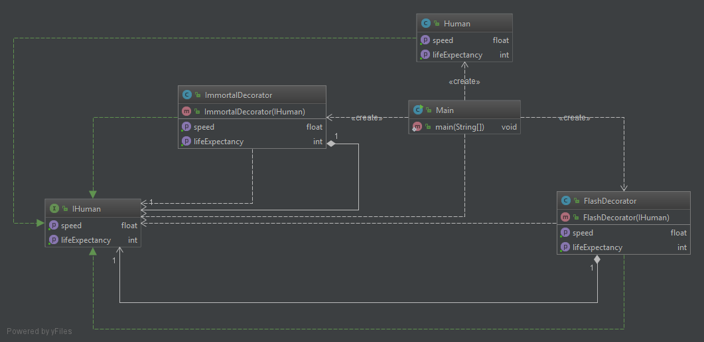

# DecoratorExample
Exemple du cours avec les décorateurs flash et immortel.



Fleche verte : Implémente  
Fleche blanche en tiret : Dépendance  
Fleche blanche avec losange : Composition    

Execution
---------
```Bash
$ javac *.java
$ java Main
Human & Immortal & Flash
Speed : 3000.0
Life  : 2147483647

Human & Flash & Immortal
Speed : 3000.0
Life  : 2147483647

Human & Immortal
Speed : 44.72
Life  : 2147483647

Human & Flash
Speed : 3000.0
Life  : 100

Human
Speed : 44.72
Life  : 100
```
